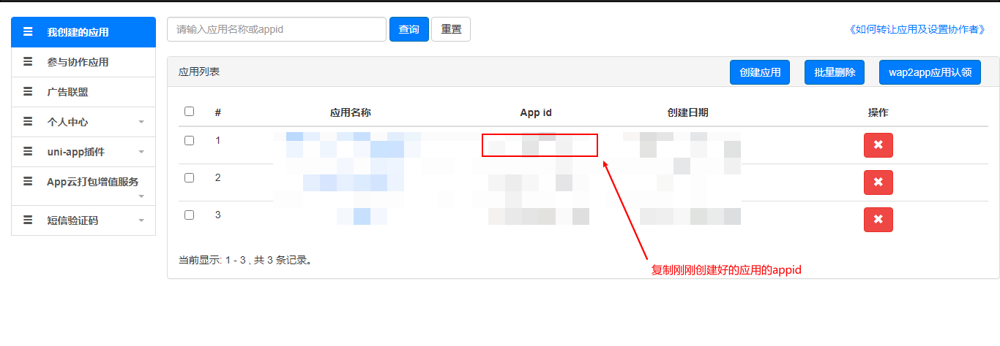

## 优惠券小程序

基于uni-app开发，非常感谢dcloud平台

### 如何使用

将本项目fork后clone到本地，并导入HbuilderX编辑器，进行简单配置，即可轻松使用。

fork操作

clone或下载操作

### 准备工作

1.HBuilderX下载[地址](https://dcloud.io/hbuilderx.html)

2.HbuilderX安装[scss/sass编译工具](https://ext.dcloud.net.cn/plugin?id=2046)插件，此处需要登录账号

3.开通uniCloud云开发，[云开发地址](https://unicloud.dcloud.net.cn/login)

4.关联云服务器

5.打开项目文件 cloudfunctions-aliyun -> db_init.json 初始化数据库

6.登录unicloud[开发者中心](https://dev.dcloud.net.cn/)获取项目appid

7.将获取到的appid填入到 manifest.json 文件中，

6.(可选) 如需微信登录，可配置cloudfunctions-aliyun -> login -> index.js
将小程序APPID与SECRET填入即可

### 注意

> assets文件夹存放了部分云存储可能需要用到的图片
